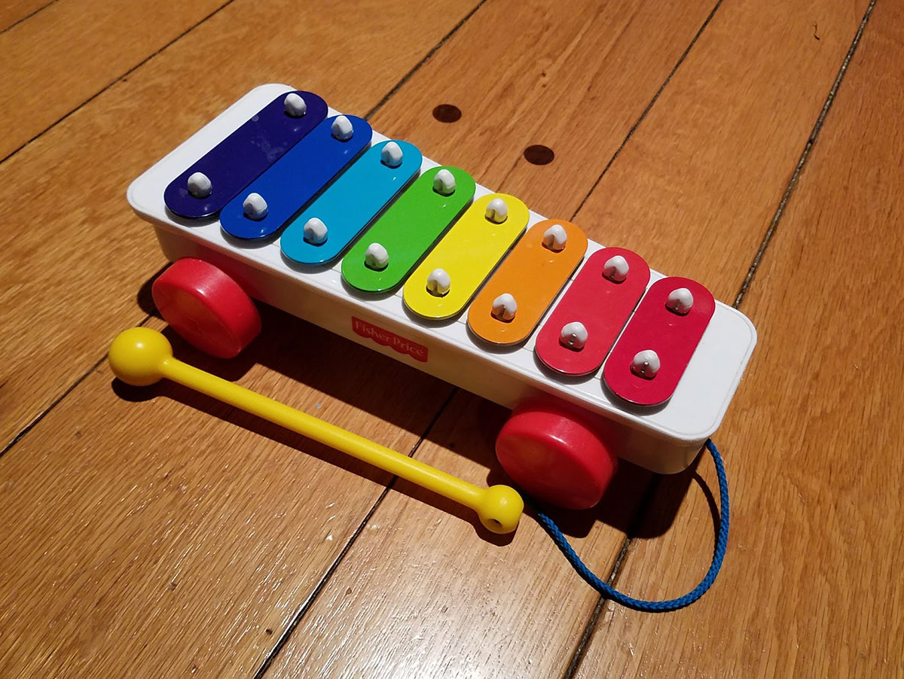
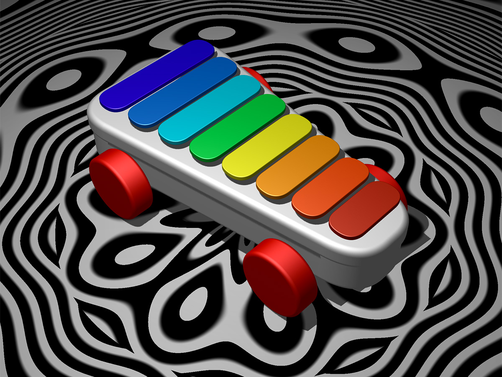

# Xylophone-Land

## About
Xylophone Land is an experiment which features a playable 3D Playskool style xylophone. To interact, simply click on the different bars of the xylophone. You will then hear the corresponding note and see a blast of color on the floor below it. You can also rotate around the scene by clicking and dragging and scroll to zoom.

### Technology used
* Nodejs with [Webpack](https://webpack.js.org/) for running the web app
* [Babel](https://babeljs.io/) for transpiling ES6
* [Three.js](https://threejs.org/) for 3D rendering using WebGL
* [Tone.js](https://tonejs.github.io/) for creating the audio using the [Web Audio API](https://developer.mozilla.org/en-US/docs/Web/API/Web_Audio_API)

### Tested Platforms
* Chrome on OSX
* Chrome on Android

### Original Photo Playskool Xylophone


### Xylophone Land screenshot



This project is available on github at [https://github.com/gregkepler/Xylophone-Land](https://github.com/gregkepler/Xylophone-Land).

## Installation

### Requirements:
* NodeJS with NPM. To install, follow these instructions at [nodejs.org](https://nodejs.org/en/download/).

### Installation and Running the app
* from the root directory, run ```node install``` to install all packages
* run ```node start``` to start the local server
* In Chrome, navigate to [http://localhost:8000](link) to view the running application

## Next Steps:
* Robust mobile and cross/browser testing and optimizations
* Add on-screen instructions
* Make the xylophone bars float and react when hit
* Model the rope and xylophone mallet so that you could use that to hit the bars
* Adjust the mono synth settings to make it sound more like an actual xylophone
* Create an npm "build" routine to generate static files to be hosted
* Limit camera controls so that you can't zoom, pan, or tilt out of specified bounds
* Solve odd shadow issues on the xylophone base

